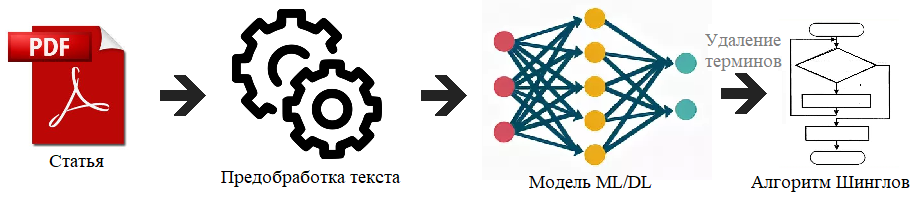

# Student’s Scientific Research Course Work
Эта работа посвящена применению методов машинного обучения в системах выявления плагиата с целью решения проблемы
узкоспециализированных понятий.

Как известно, в системах выявления плагиата, для определения уникальности текста, используется алгоритм Шинглов. Данный 
алгоритм не может определить контекст и тему научной статьи для того, чтобы исключить из проверки те слова, которые 
характерны для данной темы статьи. Это может привести к ситуации, когда человек понимает, что уникальность статьи выше 
необходимого порога, а алгоритм, поскольку работа изобилует одинаковыми словами (терминами), посчитает её недостаточно 
уникальной.

Целью работы является построение модели машинного обучения, определяющей характерные слова для данной темы, которые
будут удаляться из стати, и в свою очередь уже обработанный текст, будет поступать на вход алгоритма Шинглов.
Схематически это выглядит так:

Работа состоит из нескольких шагов:
1. __Сбор данных для анализа__. Необходимо...
 
